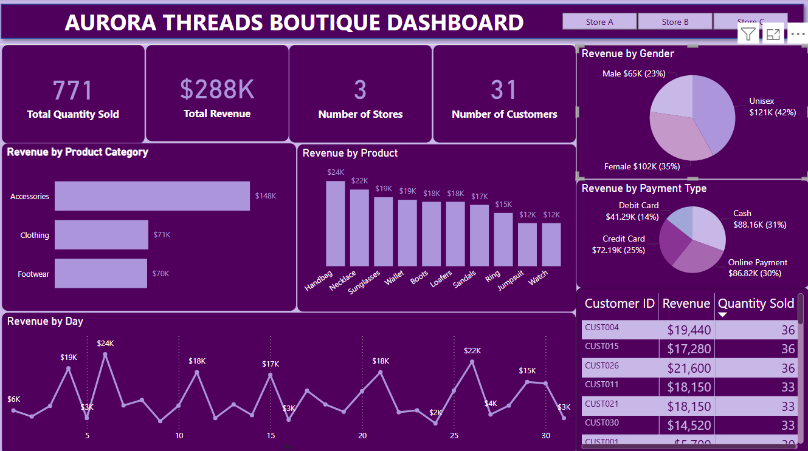

## ABOUT ME
Hello! I'm Olubowale Salisu, a result-driven data analyst with a foundation in Economics, I bring over a decade of experience in education, research, data informed decision making. I help organizations uncover insights and make data -driven decisions that drive impact.  

## SKILLS
**Data Tools & Tech:** Excel · SQL · Tableau · Power BI · Business Intelligence  
**Analytical & Soft Skills:** Research · Statistical Analysis · Data Visualization · Communication · Teaching & Mentoring

---

## WHAT I DO  
*Currently working as a Data Analyst at 10Alytics (Canada), I blend economic insights, BI tools, and educational expertise to help clients solve problems and build capacity.*

- ✅ **Data Analysis & BI Reporting**  
  Leveraging Excel, SQL, Power BI, and Tableau to transform raw data into meaningful dashboards, KPIs, and decision-support tools.

- ✅ **Research & Economic Analysis**  
  Applying quantitative and economic methods to investigate trends, support policy decisions, and guide business strategy.

- ✅ **Education & Mentorship**  
  Drawing on past teaching roles in Nigeria, I mentor students and colleagues in data analysis best practices and BI tools.

---

## MY PROFOLIO 
*A glimpse of some of the projects I've been working on.*

  **How I helped Cafe Harmony increase their Business Performance.**

  .png)
  
  https://github.com/Olubowale-web/github-portfolio/raw/main/EXCEL%20CAPSTONE_PROJECT.pptx

**How I helped to provide a comprehensive overview of retail performance for Aurora Threads Boutique.**

  

  [Read More] (https://www.linkedin.com/feed/update/urn:li:activity:7348010768707076097/)
  
- **Education & Academic Research**  
  Earned an Masters in Applied Economics and Policy from the University of Windsor, Windsor,Ontario, Canada, a Ph.D in Economics from Caleb University, Imota, Ikorodu, Lagos. Nigeria, M.Sc. in Economics from University of Lagos, Nigeia, a B.Sc in Economics from Bowen University Iwo, Osun State, Nigeria and a Postgraduate Diploma in Education from Federal College of Education (Technical), Lagos, Nigeria. 

---

## CONTACT DETAILS  
*Let’s connect and make a difference together!*

| | |
|--|--|
| 📧 | <salisuolubo@gmail.com> |
| 🌐 | [LinkedIn](https://www.linkedin.com/in/olubowale-salisu) |
| 📍 | Windsor, Ontario, Canada |

---

## WANT TO SEE MORE?  
Check out my GitHub repositories for analytical projects, datasets, and BI dashboards. I’m always open to collaborating, mentoring, or jumping into new data challenges. Looking forward to connecting!

